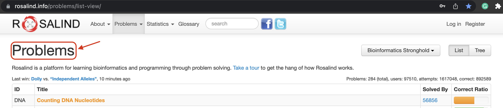

<!-- This is README.md for Rosalind related problem statements -->
# Rosalind Problems

------------

There are solutions for the below-mentioned rosalind problem statements from [website](https://rosalind.info/problems/list-view/).

<figure>

<figcaption align = "center"><i>Fig: Rosalind webpage</i></figcaption>
</figure>

| Serial No. | ID | Title |
|------------|-------------|----------|
| 1 | DNA | 	Counting DNA Nucleotides
| 2 | RNA | 	Transcribing DNA into RNA
| 3 | REVC | 	Complementing a Strand of DNA
| 4 | FIB | 	Rabbits and Recurrence Relations
| 5 | GC | 	Computing GC Content
| 6 | HAMM | 	Counting Point Mutations
| 7 | PROT | 	Translating RNA into Protein

--------------
